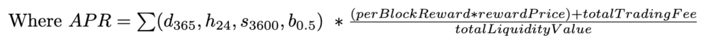

# Estimated APR Calculations

## **APR Calculations for CLMM pools**

In a CLMM pool, when price trades within an individual tick, fees are distributed proportionally to the liquidity provided by in-range positions. An accurate APR can be found for an individual tick based on trading volume within a time period, however, extrapolating this to all of the ticks in the pool and among multiple LPs is extremely complex. Traditional constant product pool APR calculations can not be directly applied to CLMM pools. **Projected returns for CLMMs should be considered as an estimate at best.**

There are **three methods for estimating APRs** for CLMM pools displayed on Raydium, each with its own calculation described in the following sections:

1. Overall Pool Estimated APR
2. Estimated APR for a user position (two methods of calculation below)
   * Delta Method
   * Multiplier Method

## Overall Pool Estimated APR 

In order to estimate an overall APR for the pool, the following is assumed: Trading fees and emissions per block are extrapolated across all of the liquidity in the pool, including liquidity positions that are out of range.

<figure><figcaption></figcaption></figure>

Delta Method - Estimated APR for user positions

